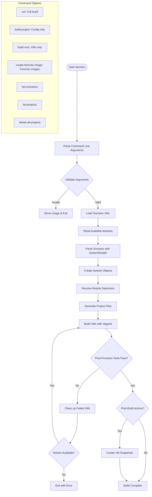
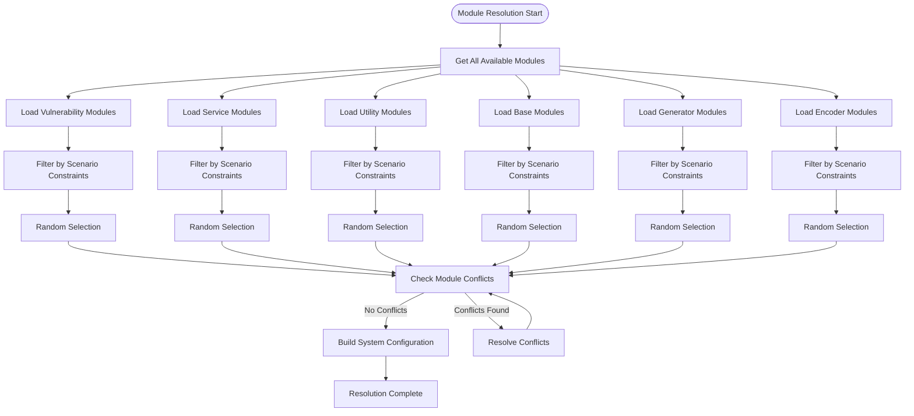
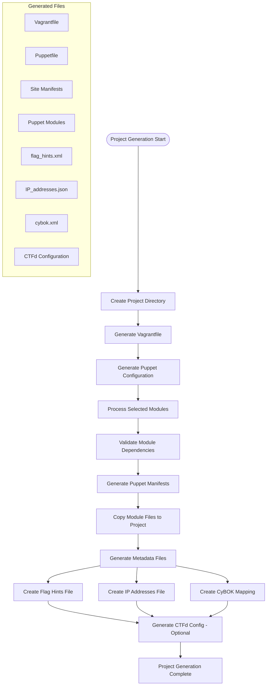
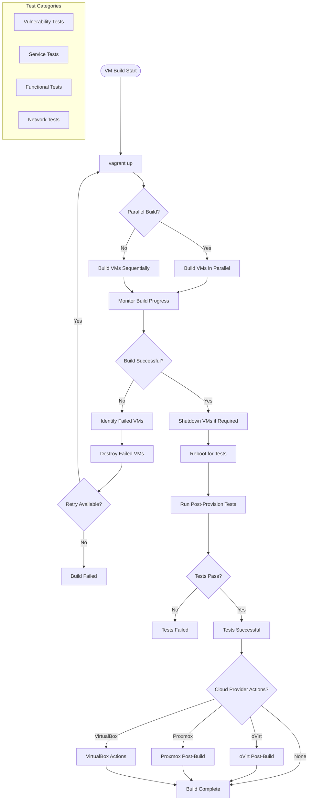
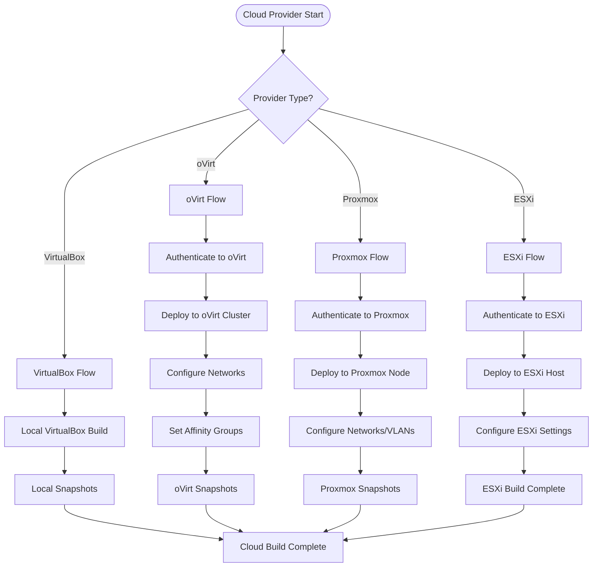
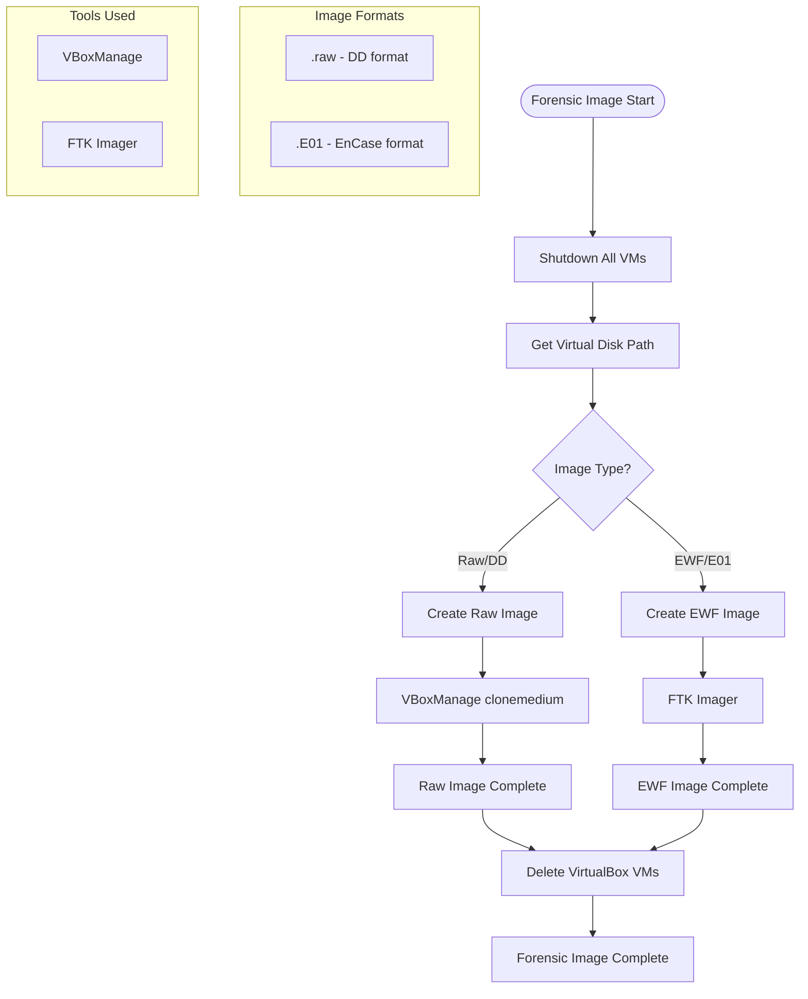
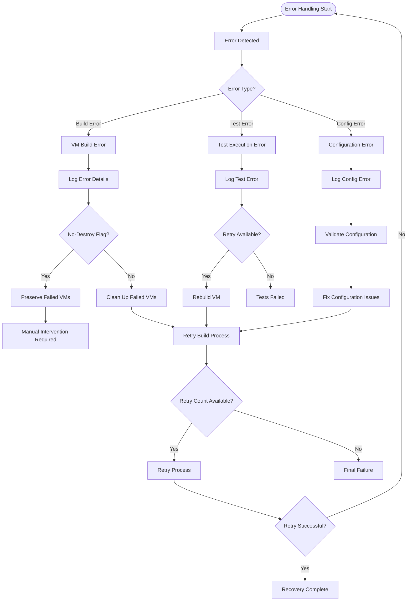

# SecGen Build Process Flow Diagram

## Main Build Flow



## Module Resolution Flow



## Project Generation Flow



## VM Build & Test Flow



## Cloud Provider Integration Flow



## Forensic Image Generation Flow



## Error Handling & Recovery Flow



## Key Configuration Points

### Scenario Configuration
- **XML Schema Validation**: Ensures scenario files conform to defined structure
- **System Definitions**: Specify base OS, vulnerabilities, services, networks
- **Constraint Resolution**: Matches requirements with available modules
- **Conflict Detection**: Identifies and resolves module conflicts

### Module Selection
- **Randomization**: Ensures unique scenarios each run
- **Filtering**: Applies scenario constraints to module pool
- **Dependency Resolution**: Handles module dependencies and conflicts
- **Resource Allocation**: Manages memory, CPU, disk resources

### Build Optimization
- **Parallel Processing**: Builds multiple VMs simultaneously
- **Retry Mechanism**: Handles transient failures
- **Resource Management**: Controls memory and CPU usage
- **Error Recovery**: Graceful handling of build failures

### Testing Framework
- **Automated Testing**: Validates vulnerabilities and services
- **Functional Verification**: Ensures systems behave as expected
- **Network Testing**: Verifies connectivity and service availability
- **Security Validation**: Confirms exploitability of vulnerabilities
```

## Architecture Summary

SecGen follows a **pipeline architecture pattern** with these key stages:

1. **Input Processing**: Parse scenarios and modules
2. **Resolution**: Map requirements to specific modules
3. **Generation**: Create project files and configurations
4. **Provisioning**: Build and configure VMs
5. **Validation**: Test and verify systems
6. **Deployment**: Optional cloud deployment and snapshots

The system emphasizes **randomization**, **modularity**, and **automation** to create diverse security scenarios for education and training purposes.